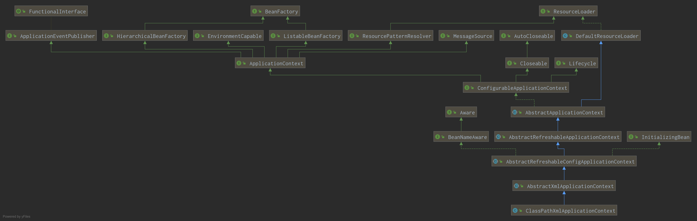

# SpringContext之xml配置(1) xml配置获取ApplicationContext并通过Class类型获取简单Bean

本系列主要介绍了SpringContext框架中，通过纯xml配置来初始化一个ApplicationContext，并通过class
参数来获取实例bean的过程，本节主要介绍了学习过程中的配置文件，以及初始化ClassPathXmlApplicationContext实例过程中的
第一部分，即处理入参字符串的部分

## 1.1 pom.xml

```xml
    <!-- https://mvnrepository.com/artifact/org.springframework/spring-context -->
    <dependency>
        <groupId>org.springframework</groupId>
        <artifactId>spring-context</artifactId>
        <version>5.1.8.RELEASE</version>
    </dependency>
```

## 1.2 application-context.xml

文件application-context.xml位于src/main/resources目录下，bean定义如下：

```xml
    <bean id="myBean" class="com.kkyeer.taste.Person">
        <property name="age" value="12"/>
        <property name="name" value="Zhang San"/>
    </bean>
```

## 1.3 Pojo类

Person.java类包含age,name两个Field，入口类比较简单，先从application-context.xml文件中加载一个ApplicationContext，再通过getBean(Person.class)方法获取Bean，最后打印验证

## 1.4 入口类

```Java
public class TasteSpringBoot {
    public static void main(String[] args) {
        ApplicationContext applicationContext = new ClassPathXmlApplicationContext("application-context.xml");
        Person person = applicationContext.getBean(Person.class);
        System.out.println(person.getName());
    }
}
```

## 2.1 初始化上下文:new ClassPathXmlApplicationContext("a-c.xml")

### 2.1.1 ClassPathXmlApplicationContext的UML



### 2.1.2 ClassPathXmlApplicationContext的构造方法

```new ClassPathXmlApplicationContext("a-c.xml")```直接调用到：

```java
    public ClassPathXmlApplicationContext(String configLocation) throws BeansException {
        this(new String[] {configLocation}, true, null);
    }
```

此构造方法显式调用到ClassPathXmlApplicationContext的另一个构造方法

```java
    public ClassPathXmlApplicationContext(
            String[] configLocations, boolean refresh, @Nullable ApplicationContext parent)
            throws BeansException {
        super(parent);
        setConfigLocations(configLocations);
        if (refresh) {
            refresh();
        }
    }
```

1. 调用父类的参数为(String[])的构造方法
2. 调用setConfigLocations(configLocations)方法
3. refresh

#### 2.1.2.1 调用父类的参数为(String[])的构造方法:super(parent)

显式调用父类的参数为（ApplicationContext parent)的的构造方法：

```java
    public AbstractXmlApplicationContext(@Nullable ApplicationContext parent) {
        super(parent);
    }
```

显式调用父类的参数为（ApplicationContext parent)的的构造方法：

```java
    public AbstractRefreshableConfigApplicationContext(@Nullable ApplicationContext parent) {
        super(parent);
    }
```

显式调用父类的参数为（ApplicationContext parent)的的构造方法：

```java
    public AbstractRefreshableApplicationContext(@Nullable ApplicationContext parent) {
        super(parent);
    }
```

显式调用父类的参数为（ApplicationContext parent)的的构造方法：

```Java
    public AbstractApplicationContext(@Nullable ApplicationContext parent) {
        this();
        setParent(parent);
    }
```

1. 显式调用了AbstractApplicationContext类的无参构造方法
2. 调用setParent(parent)方法

##### 2.1.2.1.1. AbstractApplicationContext的无参构造方法

```java
    public AbstractApplicationContext() {
        this.resourcePatternResolver = getResourcePatternResolver();
    }
```

1. 此构造方法没有显式调用任何父类的构造方法，则隐式调用直接父类的无参构造方法：

    ```java
        public DefaultResourceLoader() {
            this.classLoader = ClassUtils.getDefaultClassLoader();
        }
    ```

2. AbstractApplicationContext定义的实例变量初始化

3. 调用getResourcePatternResolver()获取并赋值到this.resourcePatternResolver

###### 2.1.2.1.1.1. DefaultResourceLoader的无参构造方法

1. 实例变量初始化

    - ```private final Set<ProtocolResolver> protocolResolvers = new LinkedHashSet<>(4);```
    - ```private final Map<Class<?>, Map<Resource, ?>> resourceCaches = new ConcurrentHashMap<>(4);```

2. 执行构造方法体

```private ClassLoader classLoader = = ClassUtils.getDefaultClassLoader();```，这里的getDefaultClassLoader方法用来获取ClassLoader，优先级：当前线程的ContextClassLoader > ClassUtils.class的ClassLoadeer > SystemClassLoader

classLoader初始化完成后，DefaultResourceLoader的无参构造方法执行完成

###### 2.1.2.1.1.2. AbstractApplicationContext定义的实例变量初始化

- ```public static final String MESSAGE_SOURCE_BEAN_NAME = "messageSource";```
- ```public static final String LIFECYCLE_PROCESSOR_BEAN_NAME = "lifecycleProcessor";```
- ```public static final String APPLICATION_EVENT_MULTICASTER_BEAN_NAME = "applicationEventMulticaster";```
- ```private String id = ObjectUtils.identityToString(this);```
- ```private String displayName = ObjectUtils.identityToString(this);```
- ```private final AtomicBoolean active = new AtomicBoolean();```false
- ```private final List<BeanFactoryPostProcessor> beanFactoryPostProcessors = new ArrayList<>();```**这是个关键列表，存储了所有介入BeanFactory处理过程的实现BeanFactoryPostProcessor的实例**
- ```private final AtomicBoolean closed = new AtomicBoolean();```false
- ```private final Object startupShutdownMonitor = new Object();```**refresh和destroy方法的Monitor对象**
- ```private final Set<ApplicationListener<?>> applicationListeners = new LinkedHashSet<>();```**ApplicationListener对象**
- ```protected final Log logger = LogFactory.getLog(getClass());```

**注意，logger字段是protected的，子类可以访问**，这里调用org.apache.commons.logging.LogFactory的getLog方法，返回的也是同一个包下的Log对象实例，实际执行过程中通过顺序尝试加载log4j_spi\log4j_slf4j\slf4j_spi\slf4j的核心类来确认当前使用的Logger，并通过LogAdapter类中的各种适配器将实际类中的方法适配到common.logging包下的Log接口的方法

###### 2.1.2.1.1.3. 构造resourcePatternResolver

调用getResourcePatternResolver()获取并赋值到this.resourcePatternResolver，后者内部初始化一个PathMatchingResourcePatternResolver对象：

1. 初始化pathMatcher：```private PathMatcher pathMatcher = new AntPathMatcher();```
2. 将PathMatchingResourcePatternResolver内部的resourceLoader变量初始化为正在初始化的ApplicationContext

以上全部执行完毕后，所有无参构造方法调用完毕，继续执行

##### 2.1.2.1.2. AbstractApplicationContext的setParent(parent)

```java
    @Override
    public void setParent(@Nullable ApplicationContext parent) {
        this.parent = parent;
        if (parent != null) {
            Environment parentEnvironment = parent.getEnvironment();
            if (parentEnvironment instanceof ConfigurableEnvironment) {
                getEnvironment().merge((ConfigurableEnvironment) parentEnvironment);
            }
        }
    }
```

对于此次给定的初始化参数来说，由于parent为null，因此此处无操作

##### 2.1.2.1.3. 逐级初始化剩下的ClassPathXmlApplicationContext父类的实例变量

1. AbstractRefreshableApplicationContext:
    - ```private final Object beanFactoryMonitor = new Object();```：这是BeanFactory创建时的Monitor对象
2. AbstractRefreshableConfigApplicationContext:
    - ```private boolean setIdCalled = false;```
3. AbstractXmlApplicationContext:
    - ```private boolean validating = true;```

至此ClassPathXmlApplicationContext显式调用的```super(parent)```构造方法全部执行完成

#### 2.1.2.2. 传入的configLocations字符串数组解析为绝对路径：setConfigLocations(configLocations)

这里configLocations是字符串数组: ["application-context.xml"]，这个方法的方法体为：

```java
    /**
     * Set the config locations for this application context.
     * <p>If not set, the implementation may use a default as appropriate.
     */
    public void setConfigLocations(@Nullable String... locations) {
        if (locations != null) {
            Assert.noNullElements(locations, "Config locations must not be null");
            this.configLocations = new String[locations.length];
            for (int i = 0; i < locations.length; i++) {
                this.configLocations[i] = resolvePath(locations[i]).trim();
            }
        }
        else {
            this.configLocations = null;
        }
    }
```

校验输入后，遍历传入的configLocations数组，对每个元素分别调用resolvPath()方法并存入this.configLocations数组

##### 2.1.2.2.1 用系统的环境变量替换Config Location字符串中的PlaceholderresolvePath方法

```java
    /**
     * Resolve the given path, replacing placeholders with corresponding
     * environment property values if necessary. Applied to config locations.
     * @param path the original file path
     * @return the resolved file path
     * @see org.springframework.core.env.Environment#resolveRequiredPlaceholders(String)
     */
    protected String resolvePath(String path) {
        return getEnvironment().resolveRequiredPlaceholders(path);
    }
```

获取ApplictionContext的environment，为空则new StandardEnvironment()并放入

###### 2.1.2.2.1.1 StandardEnvironment的初始化

此类的父类为AbstractEnvironment，StandardEnvironment在父类基础上复写了customizePropertySources方法，大部分初始化及方法都在父类中，下面是父类AbstractEnvironment初始化的过程

1. AbstractEnvironment的实例变量初始化

    - ```private final MutablePropertySources propertySources = new MutablePropertySources();```
    父类内部维护了一个MutablePropertySources类型的propertySources变量，此类型本质上是CopyOnWriteArrayList\<PropertySource>，而PropertySource是对Map对象（或其实现等K-V对容器）的再包装，子类需要提供根据key获取值、删除某键值对等方法

    - ```private final ConfigurablePropertyResolver propertyResolver = new PropertySourcesPropertyResolver(this.propertySources);```，propertyResolver是Environment的核心成员变量，其他的属性等均是为此成员变量服务的，在AbstractEnvironment初始化过程中，将内部维护的propertySources属性传递给新初始化的ConfigurablePropertyResolver实例，PropertySourcesPropertyResolver主要是复写了父类的getProperty方法,主要的初始化工作由父类AbstractPropertyResolver完成：主要是final类型字符串常量的初始化

AbstractEnvironment的无参构造方法调用了customizePropertySources(this.propertySources);方法，StandardEnvironment复写了此方法，加载以下两部分Property：

1. "systemProperties"，值为System.getProperties()返回的map包装成的PropertiesPropertySource
2. "systemEnvironment"，值为System.getenv()返回的map包装成的SystemEnvironmentPropertySource，值得一提的是如果提供了spring.properties文件并指定spring.getenv.ignore=false，则不加载

###### 2.1.2.2.1.2 new StandardEnvironment().resolveRequiredPlaceholders(path)

实际调用的是AbstractEnvironment类的resolveRequiredPlaceholders(String text)方法：

```java
    @Override
    public String resolveRequiredPlaceholders(String text) throws IllegalArgumentException {
        return this.propertyResolver.resolveRequiredPlaceholders(text);
    }
```

调用了propertyResolver的对应方法

```java
    @Override
    public String resolveRequiredPlaceholders(String text) throws IllegalArgumentException {
        if (this.strictHelper == null) {
            this.strictHelper = createPlaceholderHelper(false);
        }
        return doResolvePlaceholders(text, this.strictHelper);
    }
```

其中createPlaceholderHelper(false)为核心方法：

```java
    private PropertyPlaceholderHelper createPlaceholderHelper(boolean ignoreUnresolvablePlaceholders) {
        return new PropertyPlaceholderHelper(this.placeholderPrefix, this.placeholderSuffix,
                this.valueSeparator, ignoreUnresolvablePlaceholders);
    }
```

这个类是一个辅助类，用来把对应字符串的占位符替换成已经加载的相关property，比如字符串
"${abcd}"会被替换成abcd对应的property值返回

### 2.2.3. ClassPathXmlApplicationContext调用refresh()方法

ClassPathXmlApplicationContext没有复写此方法，实际调用的是父类AbstractApplicationContext的refresh方法，在这个方法中会进行Bean的初始化，具体的过程参考[第二节](./XmlContext_2_refresh.md)

## 2.2 获取单例Bean：applicationContext.getBean(Person.class)

调用初始化完成的上下文的BeanFactory的getBean方法：

```java
	@Override
	public <T> T getBean(Class<T> requiredType) throws BeansException {
		return getBean(requiredType, (Object[]) null);
	}
```
