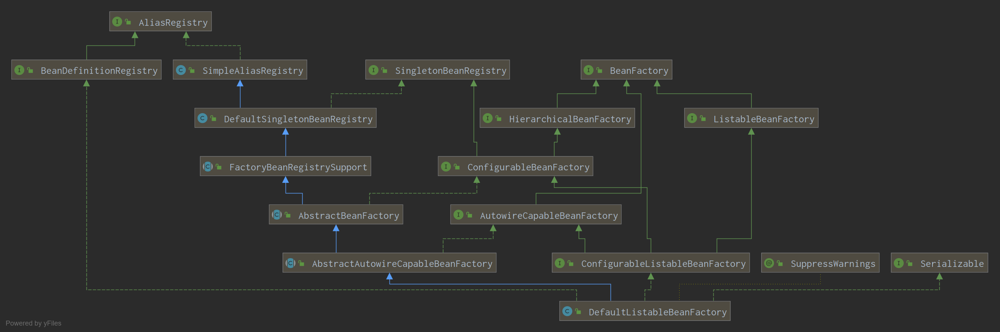
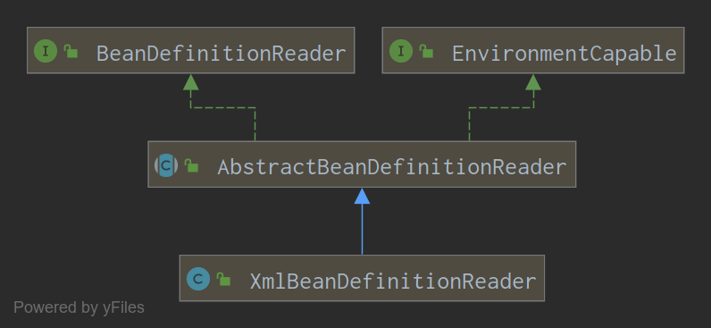

# SpringContext之xml配置(2) new XmlApplicationContext("a-c.xml")过程的refresh()方法:规整configLocation成Resource数组

内容接续[第一节:configLocation参数处理](./XmlContext_1_process_config.md)，在处理完configLocation并执行完父类的构造方法后，正式开始扫描Xml并进行bean的构造与存储，即执行ClassPathXmlApplicationContext类的父类AbstractApplicationContext的refresh()方法，代码如下：

```java
	/**
	 * Load or refresh the persistent representation of the configuration,
	 * which might an XML file, properties file, or relational database schema.
	 * <p>As this is a startup method, it should destroy already created singletons
	 * if it fails, to avoid dangling resources. In other words, after invocation
	 * of that method, either all or no singletons at all should be instantiated.
	 * @throws BeansException if the bean factory could not be initialized
	 * @throws IllegalStateException if already initialized and multiple refresh
	 * attempts are not supported
	 */
	@Override
	public void refresh() throws BeansException, IllegalStateException {
		synchronized (this.startupShutdownMonitor) {
			// Prepare this context for refreshing.
			prepareRefresh();

			// Tell the subclass to refresh the internal bean factory.
			ConfigurableListableBeanFactory beanFactory = obtainFreshBeanFactory();

			// Prepare the bean factory for use in this context.
			prepareBeanFactory(beanFactory);

			try {
				// Allows post-processing of the bean factory in context subclasses.
				postProcessBeanFactory(beanFactory);

				// Invoke factory processors registered as beans in the context.
				invokeBeanFactoryPostProcessors(beanFactory);

				// Register bean processors that intercept bean creation.
				registerBeanPostProcessors(beanFactory);

				// Initialize message source for this context.
				initMessageSource();

				// Initialize event multicaster for this context.
				initApplicationEventMulticaster();

				// Initialize other special beans in specific context subclasses.
				onRefresh();

				// Check for listener beans and register them.
				registerListeners();

				// Instantiate all remaining (non-lazy-init) singletons.
				finishBeanFactoryInitialization(beanFactory);

				// Last step: publish corresponding event.
				finishRefresh();
			}

			catch (BeansException ex) {
				if (logger.isWarnEnabled()) {
					logger.warn("Exception encountered during context initialization - " +
							"cancelling refresh attempt: " + ex);
				}

				// Destroy already created singletons to avoid dangling resources.
				destroyBeans();

				// Reset 'active' flag.
				cancelRefresh(ex);

				// Propagate exception to caller.
				throw ex;
			}

			finally {
				// Reset common introspection caches in Spring's core, since we
				// might not ever need metadata for singleton beans anymore...
				resetCommonCaches();
			}
		}
	}
```

## 1.1 准备环境：prepareRefresh()

prepareRefresh方法的执行过程如方法名所示，主要进行环境变量的操作、日志的打印以及某些listener的处理，主要过程如下：

1. 更改当前Context的状态，```startupDate=当前时间;closed=false;active=true;```
2. 打印debug记录
3. 初始化上下文中的propertySources占位，在这个类里是空方法体
4. 初始化earlyApplicationListeners和applicationListeners，当前用例里为空，注意存储使用的是LinkedHashSet，是有序set
5. 初始化earlyApplicationEvents为空的LinkedHashSet

## 1.2 初始化空beanFactory：ConfigurableListableBeanFactory beanFactory = obtainFreshBeanFactory()

```java
	protected ConfigurableListableBeanFactory obtainFreshBeanFactory() {
		refreshBeanFactory();
		return getBeanFactory();
	}
```

方法中主要是调用了方法refreshBeanFactory()，然后返回getBeanFactory()的执行结果，这两个方法在AbstractApplicationContext中均为抽象方法，对于本例来说，实际由子类
AbstractRefreshableApplicationContext实现

### 1.2.1 refreshBeanFactory()

此方法的具体代码如下：

```java
	/**
	 * This implementation performs an actual refresh of this context's underlying
	 * bean factory, shutting down the previous bean factory (if any) and
	 * initializing a fresh bean factory for the next phase of the context's lifecycle.
	 */
	@Override
	protected final void refreshBeanFactory() throws BeansException {
		if (hasBeanFactory()) {
			destroyBeans();
			closeBeanFactory();
		}
		try {
			DefaultListableBeanFactory beanFactory = createBeanFactory();
			beanFactory.setSerializationId(getId());
			customizeBeanFactory(beanFactory);
			loadBeanDefinitions(beanFactory);
			synchronized (this.beanFactoryMonitor) {
				this.beanFactory = beanFactory;
			}
		}
		catch (IOException ex) {
			throw new ApplicationContextException("I/O error parsing bean definition source for " + getDisplayName(), ex);
		}
	}
```

执行过程分析：

1. 销毁当前所有已经创建的bean，关闭beanFactory
2. 创建一个新的beanFactory并赋值新序列号
3. 自定义beanFactory
4. 加载bean定义
5. 赋值给当前ApplicationContext的beanFactory

主要关注点应该在第2、3、4步中：

#### 1.2.1.1 初始化BeanFactory:createBeanFactory()

```java
	protected DefaultListableBeanFactory createBeanFactory() {
		return new DefaultListableBeanFactory(getInternalParentBeanFactory());
	}
```

注意到初始化的BeanFactory类型为DefaultListableBeanFactory，且此处调用的是带参构造方法，参数类型为BeanFactory，值为getInternalParentBeanFactory()方法的返回值，实例初始化的过程可分为三步



1. DefaultListableBeanFactory的类加载、final变量加载
2. 获取getInternalParentBeanFactory()方法的返回值
3. 构造器调用

##### 1.2.1.1.1 DefaultListableBeanFactory的类加载、final变量加载

1. 静态代码块，测试classpath中是否有```javax.inject.Provider```类
2. Map from serialized id to factory instance.```private static final Map<String, Reference<DefaultListableBeanFactory>> serializableFactories = new ConcurrentHashMap<>(8);```

##### 1.2.1.1.2 getInternalParentBeanFactory()

```java
	return (getParent() instanceof ConfigurableApplicationContext ?
				((ConfigurableApplicationContext) getParent()).getBeanFactory() : getParent());
```

如果this.parent变量指向的是ConfigurableApplicationContext，则返回this.parent.getBeanFactory()，否则返回this.parent，对于当前用例，this.parent == null，所以返回null

##### 1.2.1.1.3 DefaultListableBeanFactory构造器调用

1. 显示调用super的带参构造方法```public DefaultListableBeanFactory(@Nullable BeanFactory parentBeanFactory) {super(parentBeanFactory);}```
2. 父类AbstractAutowireCapableBeanFactory的带参构造方法

AbstractAutowireCapableBeanFactory类主要实现了bean的创建、初始化、参数注入、构造方法注入等功能

```java
	public AbstractAutowireCapableBeanFactory(@Nullable BeanFactory parentBeanFactory) {
		this();
		setParentBeanFactory(parentBeanFactory);
	}
```

this()调用的无参构造方法:

```java
	public AbstractAutowireCapableBeanFactory() {
		super();
		ignoreDependencyInterface(BeanNameAware.class);
		ignoreDependencyInterface(BeanFactoryAware.class);
		ignoreDependencyInterface(BeanClassLoaderAware.class);
	}
```

super()调用的父类无参构造方法，沿继承链上溯到DefaultSingletonBeanRegistry类中，

###### 1.2.1.1.3.1 DefaultSingletonBeanRegistry类的初始化

此类中定义了存取SingletonBean的缓存和相关方法，其中主要属性列举如下：

1. 存储各种bean的缓存：

- Cache of singleton objects: bean name to bean instance. ```private final Map<String, Object> singletonObjects = new ConcurrentHashMap<>(256);```
- Cache of singleton factories: bean name to ObjectFactory.```private final Map<String, ObjectFactory<?>> singletonFactories = new HashMap<>(16);```
- Cache of early singleton objects: bean name to bean instance.```private final Set<String> registeredSingletons = new LinkedHashSet<>(256);```
- Disposable bean instances: bean name to disposable instance.```private final Map<String, Object> disposableBeans = new LinkedHashMap<>();```

注意，存储单例对象的缓存应该是主要缓存，且会被并发访问，因此使用ConcurrentHashMap保证线程安全的同时，初始容量设置为256来减少初期的Map扩容

2. 存储bean和bean关系的各种Map:

- Map between containing bean names: bean name to Set of bean names that the bean contains.```private final Map<String, Set<String>> containedBeanMap = new ConcurrentHashMap<>(16);```
- Map between dependent bean names: bean name to Set of dependent bean names.```private final Map<String, Set<String>> dependentBeanMap = new ConcurrentHashMap<>(64);```
- Map between depending bean names: bean name to Set of bean names for the bean's dependencies.```private final Map<String, Set<String>> dependenciesForBeanMap = new ConcurrentHashMap<>(64);```

除了存储创建好的Bean的缓存外，还有一些属性，表征创建过程状态的如singletonsCurrentlyInCreation，inCreationCheckExclusions，singletonsCurrentlyInDestruction等。

DefaultSingletonBeanRegistry初始化完成后，沿继承链轮到DefaultListableBeanFactory的父类AbstractBeanFactory初始化：

###### 1.2.1.1.3.2 AbstractBeanFactory类

这个类中，除从父类继承来的SingletonBean相关属性方法外，还定义了很多处理类和更多的缓存变量，列举如下：

1. bean过程处理相关的类和flag

- ClassLoader：
- beanMetaData的flag：是否缓存metaData，默认true
- propertyEditorRegistrars：Set\<PropertyEditorRegistrar>类型
- ```Map<Class<?>, Class<? extends PropertyEditor>> customEditors```，自定义的PeropertyEditors
- ```List<StringValueResolver> embeddedValueResolvers```:String resolvers to apply e.g. to annotation attribute values.
- ```List<BeanPostProcessor> beanPostProcessors```

2. Bean缓存变量和过程变量

- ```Map<String, Scope> scopes```:Map from scope identifier String to corresponding Scope.
- ```Map<String, RootBeanDefinition> mergedBeanDefinitions```:Map from bean name to merged RootBeanDefinition.
- ```Set<String> alreadyCreated```:Names of beans that have already been created at least once.
- ```ThreadLocal<Object> prototypesCurrentlyInCreation```:Names of beans that are currently in creation.

AbstractBeanFactory实例初始化完成后，沿继承链回到AbstractAutowireCapableBeanFactory类的初始化

###### 1.2.1.1.3.3 AbstractAutowireCapableBeanFactory的变量初始化

父类全部初始化完成后，初始化本类的变量：

- ```private InstantiationStrategy instantiationStrategy = new CglibSubclassingInstantiationStrategy();```
- ```private ParameterNameDiscoverer parameterNameDiscoverer = new DefaultParameterNameDiscoverer();```
- ```private final Set<Class<?>> ignoredDependencyTypes = new HashSet<>();```
- ```private final Set<Class<?>> ignoredDependencyInterfaces```,注意，这个set在空构造器中被放入了BeanNameAware、BeanFactoryAware、BeanClassLoaderAware三个接口
- ```private final NamedThreadLocal<String> currentlyCreatedBean```:The name of the currently created bean, for implicit dependency registration on getBean etc invocations triggered from a user-specified Supplier callback.
- ```private final ConcurrentMap<String, BeanWrapper> factoryBeanInstanceCache```:Cache of unfinished FactoryBean instances: FactoryBean name to BeanWrapper.
- ```private final ConcurrentMap<Class<?>, Method[]> factoryMethodCandidateCache```:Cache of candidate factory methods per factory class.
- ```private final ConcurrentMap<Class<?>, PropertyDescriptor[]> filteredPropertyDescriptorsCache```:Cache of filtered PropertyDescriptors: bean Class to PropertyDescriptor array.

在初始化完成上述变量后将this.parentBeanFactory=parentBeanFactory也就是null，至此AbstractAutowireCapableBeanFactory实例初始化完成

##### 1.2.1.1.4 DefaultListableBeanFactory变量初始化

- ```private AutowireCandidateResolver autowireCandidateResolver = new SimpleAutowireCandidateResolver();```
- ```private final Map<Class<?>, Object> resolvableDependencies```:依赖Class到实例
- ```private final Map<String, BeanDefinition> beanDefinitionMap```:bean名到bean定义
- ```private final Map<Class<?>, String[]> allBeanNamesByType```:依赖class到bean名的数组，不管bean是否单例
- ```private final Map<Class<?>, String[]> singletonBeanNamesByType```:依赖class到bean名的数组，bean是单例
- ```private volatile List<String> beanDefinitionNames```:按register顺序存储的beanDefinitionNames
- ```private volatile Set<String> manualSingletonNames```:按register顺序存储的手动注册的单例

上述属性初始化完成后，DefaultListableBeanFactory初始化完成，初始化完成的DefaultListableBeanFactory实例返回到refreshBeanFactory方法，返回的beanFactory被赋值序列号：类名@hashcode

#### 1.2.1.2 customizeBeanFactory(beanFactory)

根据当前上下文的变量更新beanFactory的allowBeanDefinitionOverriding和allowCircularReferences属性，当前用例中都是null，因此无操作

#### 1.2.1.3 AbstractXmlApplicationContext对象方法：loadBeanDefinitions(beanFactory)

将所有的bean定义加载到内部的beanFactory，ClassPathXmlApplicationContext的父类AbstractXmlApplicationContext复写了这个方法：

```java
	@Override
	protected void loadBeanDefinitions(DefaultListableBeanFactory beanFactory) throws BeansException, IOException {
		// Create a new XmlBeanDefinitionReader for the given BeanFactory.
		XmlBeanDefinitionReader beanDefinitionReader = new XmlBeanDefinitionReader(beanFactory);

		// Configure the bean definition reader with this context's
		// resource loading environment.
		beanDefinitionReader.setEnvironment(this.getEnvironment());
		beanDefinitionReader.setResourceLoader(this);
		beanDefinitionReader.setEntityResolver(new ResourceEntityResolver(this));

		// Allow a subclass to provide custom initialization of the reader,
		// then proceed with actually loading the bean definitions.
		initBeanDefinitionReader(beanDefinitionReader);
		loadBeanDefinitions(beanDefinitionReader);
	}
```

XmlBeanDefinitionReader的初始化和赋值，并分别初始化beanDefinitionReader的environment,resourceLoader和entityResolver变量，initBeanDefinitionReader(beanDefinitionReader)方法把this.validating变量赋值给beanDefinationReader.validating，最后的loadBeanDefinitions(beanDefinitionReader)方法最终通过beanDefinationReader的帮助，将xml里的bean声明加载出来，加载的顺序如代码所示：

```java
	protected void loadBeanDefinitions(XmlBeanDefinitionReader reader) throws BeansException, IOException {
		Resource[] configResources = getConfigResources();
		if (configResources != null) {
			reader.loadBeanDefinitions(configResources);
		}
		String[] configLocations = getConfigLocations();
		if (configLocations != null) {
			reader.loadBeanDefinitions(configLocations);
		}
	}
```

对于AbstractXmlApplicationContext，configResources为null，在本用例中，configLocations={"application-context.xml"},
调用到XmlBeanDefinitionReader实例的loadBeanDefinitions(configLocations)

##### 1.2.1.3.1 XmlBeanDefinitionReader实例的reader.loadBeanDefinitions(configLocations)方法

下面是XmlBeanDefinitionReader的类UML图


实际调用的是抽象类AbstractBeanDefinitionReader的方法

```java
	public int loadBeanDefinitions(String location, @Nullable Set<Resource> actualResources) throws BeanDefinitionStoreException {
		ResourceLoader resourceLoader = getResourceLoader();
		if (resourceLoader == null) {
			throw new BeanDefinitionStoreException(
					"Cannot load bean definitions from location [" + location + "]: no ResourceLoader available");
		}

		if (resourceLoader instanceof ResourcePatternResolver) {
			// Resource pattern matching available.
			try {
				Resource[] resources = ((ResourcePatternResolver) resourceLoader).getResources(location);
				int count = loadBeanDefinitions(resources);
				if (actualResources != null) {
					Collections.addAll(actualResources, resources);
				}
				if (logger.isTraceEnabled()) {
					logger.trace("Loaded " + count + " bean definitions from location pattern [" + location + "]");
				}
				return count;
			}
			catch (IOException ex) {
				throw new BeanDefinitionStoreException(
						"Could not resolve bean definition resource pattern [" + location + "]", ex);
			}
		}
		else {
			// Can only load single resources by absolute URL.
			Resource resource = resourceLoader.getResource(location);
			int count = loadBeanDefinitions(resource);
			if (actualResources != null) {
				actualResources.add(resource);
			}
			if (logger.isTraceEnabled()) {
				logger.trace("Loaded " + count + " bean definitions from location [" + location + "]");
			}
			return count;
		}
	}
```

在这里，入参location是字符串"application-context.xml"，actualResources为null，程序执行过程如下

1. 获取resourceLoader对象，此对象负责把入参的location字符串规整为Resource对象数组
2. 遍历上一步规整好的Resource数组，对每一个Resource对象调用loadBeanDefinitions方法，此方法将初始化好的bean定义存入reader内部的registry变量中，
此变量即ApplicationContext的refresh方法新创建的beanFactory，在初始化reader的过程中被关联进来
3. 返回加载的BeanDefinition的数量

对于当前实例来说

1. 第一步中，resourceLoader在初始化过程中被赋值成当前的ClassPathXmlApplicationContext
2. 第二步中，调用getResource(location)方法获取Resource数组时，程序中判断resourceLoader是否是ResourcePatternResolver实例，是则调用ResourcePatternResolver实例的方法,否则调用resourceLoader的方法来加载，在本例中，由于AbstractApplicationContext实现ResourcePatternResolver接口，因此调用了实现方法：```return this.resourcePatternResolver.getResources(locationPattern);```，在这里this.resourcePatternResolver为PathMatchingResourcePatternResolver对象

###### 1.2.1.3.1.1 读取Resource数组：PathMatchingResourcePatternResolver实例方法：getResources(locationPattern)

此方法根据传入的字符串的特征来调用相应的策略，将传入的字符串解析成Resource数组，策略按顺序如下：

1. "classpath*:"开头的，首先检测是否有通配符('*','?',{})等，如果有，则遍历所有的classpath上的文件包括jar和zip文件来匹配并返回，如果没有通配符，则调用内部ClassLoader的getResources方法匹配相关路径，将结果包裹在UrlResource对象数组中返回
2. 非"classpath*:"开头的，首先检测是否有通配符('*','?',{})等，如果有，则遍历所有的classpath上的文件包括jar和zip文件来匹配并返回，否则就是当前实例的情况，调用内部ClassLoader的getResources方法匹配相关路径，将结果包裹在UrlResource对象数组中返回，当前实例的ResourceLoader是当前的ClassPathXmlApplicationContext，其中resourceLoader相关的方法在父类DefaultResourceLoader中实现，此方法同样是对传入值进行各种模式判断，再根据判断结果使用不同的策略来返回结果，

    1. ”/“开头的，将参数包裹为ClassPathContextResource对象返回
    2. ”classpath:"开头的，去掉”classpath:"后将参数包裹为ClassPathResource对象返回
    3. 上述都不符合，首先尝试包装参数成URL对象，再根据Url对象的protocol包装成FileUrlResource或者UrlResource对象
    4. 无法解析成URL对象的，如本例的入参，则将参数包装成ClassPathContextResource对象返回，本例符合这种情况

至此所有的configLocation字符串已经解析成Resource数组，当前实例中为一个ClassPathContextResource对象的数组，返回后，程序将继续进行Bean定义的读取

###### 1.2.1.3.1.2 AbstractBeanDefinitionReader从Resource对象中加载Bean定义

见下一节[AbstractBeanDefinitionReader从Resource对象中加载Bean定义](XmlContext_3_LoadResource.md)
